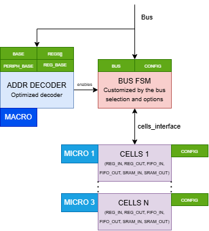
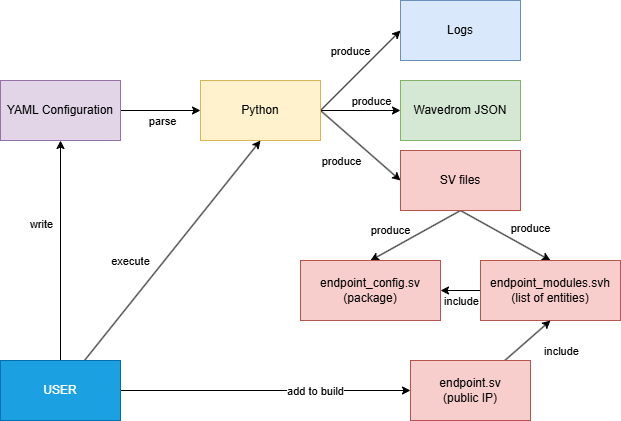

# Doc

Write here all markdown about the IP, including the different modules. This is important, as it may be the last knowledge about what's really done...

## Global architecture of the IP : 

The IP is based on multiple smaller blocks, to provide an high level of optimization of the RTL code.
For example, here a small list : 

* Macro-decoder : Decode the provided address, and detect if the address is within the range of the IP. This block is basically a comparator.
  It use the prefix_size field to known where to split the address.
* Bus-FSM : The state machine that is replaced, depending on the configured protocol.
  It provide a simpler protocol to access the local registers, without wiring the full featured bus. 
* Cells : The smaller cells as possible. Provide a single feature, over a simple bus.
  When adding fields to an IP, you're actually adding this kind of block to the design.
  Each cell contain it's own, small decoder, to provide the required local feature (register enable, address selection...)

### Communication between FSM and Cells : 

As said before, between the FSM and the Cells there's a simpler protocol. The cells are communicating with the following 
[specification](../rtl/config/cell_interface.sv). The signals are done to be the simpler, and therefore use the smallest footprint, 
espacially on ASIC targets.

There's three mandatory signals : 

* request : Set to 1 by the master FSM, when a request must be handled. This is actually the decoder output. This also enable the output registers.
* done : Set to 1 when a request was handled, in any manner (with or without error).
* error : Set to 1 when an error was detected, for example a wrong error.

In any cases, after a request was triggered, a counter is launched. Without response before the end, an SLVERR code will be send to not
stall the bus.

### Outputs on the local design : 

Each cell provide an output interface to the user. This spec is [documented here](../rtl/buses/reg_interface/README.md).

## Workflow with the IP :

1) First, write the YAML config as shown in an example. This file is the single source of truth.
   Some notes : The registers MUST be declared in order, otherwise some checks may fail.

2) Execute the python script to generate the RTL and documentation files.

3) Include the top level file (endpoint.sv) file into your project. Add the provided sources. And done.

